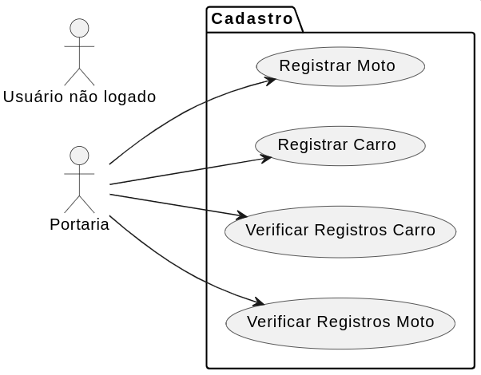

## Primeira Avaliação DESENVOLVIMENTO WEB II

## Como Realizar esta avaliação ?

1. Crie um repositório no seu github com o nome "<b>FATEC_DES_WEB2_2024_Avaliacao1</b>"
2. Publicar no Teams o repositório que será avaliado pelo professor Orlando.

##  Desafio Técnico

Crie um cadastro em PHP de alunos que poderão fazer uso do estacionamento da Fatec Araras. Os campos que devem estar cadastrados são: 

 - Nome Completo
 - Registro Acadêmico (R.A.)
 - Placa do Carro ou Moto

Para poder fazer uso do estacionamento, o setor de vigilância irá conferir se o aluno e carro estão cadastrados. 

### 1- DashBoard - Área de login/logout
- Com uso de sessões (sessions), criar uma área de login. Permitir encerrar sessão (logout). Para realizar login/logout, necessário ter um único login e senha.
- Login: <b>portaria</b>
- Senha: <b>FatecAraras</b>

### 2- Criar registro (30% da nota)
- Cadastrar os campos supracitados em arquivo texto. <b>Será possível realizar o cadastro somente em uma sessão ativa</b>. Ao tentar cadastrar em uma sessão desativada, redirecionar para a área de login.

- No arquivo texto, o padrão de gravação deve ser: Nome, seguido de uma barra, RA,seguido de uma barra e a placa do carro.

- Os registros de veículos deverão ser salvos no arquivo texto <b>carros.txt</b>.

- Os registros de veículos deverão ser salvos no arquivo texto <b>motos.txt</b>.

Exemplo:
  
José da Silva|202311111111|ABC1234
 
Maria de Souza|202322222222|ABC1234
  
### 3- Ler todos os registros cadastrados 
- <b>Em uma área de sessão</b>, permitir ler todos os registros cadastrados nos arquivos texto. Caso não esteja em uma sessão ativa, redirecionar para a área de login.

- Seu sistema terá um botão "Visualizar carros". Ao clicar, deve carregar uma página php, que irá acessar todos os registros do arquivo texto <b>carros.txt</b> e apresentar ao usuário logado.

- Seu sistema terá um botão "Visualizar motos". Ao clicar, deve carregar uma página php, que irá acessar todos os registros do arquivo texto <b>motos.txt</b> e apresentar ao usuário logado.

- Tecnologias: PHP Estruturado.

 
<b>GIT HUB</b> | Professor Orlando Saraiva  
- https://github.com/orlandosaraivajr
